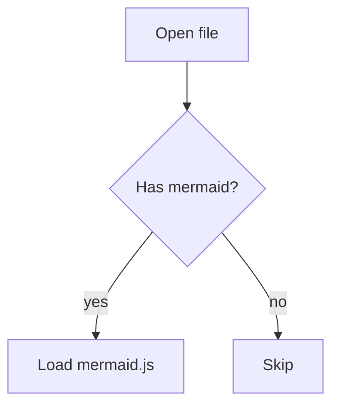

# mdreader demo

A quick tour of what the renderer supports.

## Text formatting

Plain text, **bold**, *italic*, ~~strikethrough~~, and `inline code`.

## Task list

- [x] Render GFM tables
- [x] Syntax-highlight code fences
- [ ] Ship the Windows installer

## Table

| Feature | Status |
|---|---|
| Tabs | done |
| TOC | done |
| Find | done |

## Code

```rust
fn main() {
    println!("Hello, mdreader!");
}
```

## Diagram



## Math

Euler's identity: $e^{i\pi} + 1 = 0$

$$
\int_0^1 x^2 \, dx = \frac{1}{3}
$$

## Raw HTML

<div style="padding: 8px; border: 1px solid #ccc;">Raw HTML block passes through sanitized.</div>

## Footnote

Here's a claim with a footnote.[^1]

[^1]: The footnote text.
